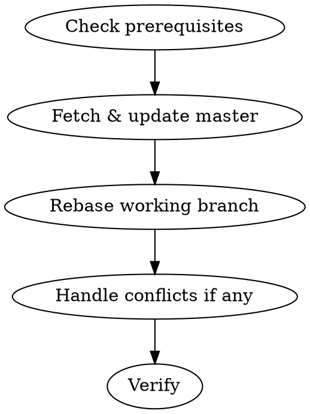

# Integrate Main Branch Changes

## Overview

Pull latest changes from `origin/master` into the local `master` branch, then rebase the current working branch onto `master`. This keeps the working branch up to date without merge commits.

**Core principle:** Always rebase, never merge. The working branch should sit cleanly on top of master's latest commit.

## When to Use

- Before starting significant new work on a feature branch
- When remote master has new commits you need
- Before opening a PR to reduce conflicts
- When the user says "sync", "update from master", "pull latest", or "rebase onto master"

**When NOT to use:**
- When already on master (just `git pull --rebase` instead)
- When the user explicitly asks for a merge

## The Process



### Step 1: Check Prerequisites

```bash
# Capture current branch name
git branch --show-current

# Check for uncommitted changes
git status
```

**If there are uncommitted changes:** Stop and ask the user whether to commit, stash, or abort. Do NOT proceed with a dirty working tree.

**If on master:** Stop and tell the user they're already on master. Offer to just `git pull --rebase origin master` instead.

### Step 2: Fetch and Update Local Master

```bash
# Store current branch
CURRENT_BRANCH=$(git branch --show-current)

# Fetch latest from origin
git fetch origin master

# Update local master without switching branches
git update-ref refs/heads/master origin/master
```

**Why `update-ref`:** This updates the local master ref to match origin/master without needing to checkout master. It's safe when master has no local-only commits (which it shouldn't in a rebase workflow).

**If local master has local-only commits** (user has been committing directly to master): Fall back to the checkout method:
```bash
git checkout master
git pull --rebase origin master
git checkout "$CURRENT_BRANCH"
```

### Step 3: Rebase Working Branch onto Master

```bash
git rebase master
```

### Step 4: Handle Conflicts

If rebase reports conflicts:
1. Tell the user which files have conflicts
2. Help resolve them if asked
3. After resolving: `git add <resolved-files> && git rebase --continue`
4. If the user wants to abort: `git rebase --abort`

**Never force-resolve conflicts without user input.**

### Step 5: Verify

```bash
git log --oneline -5
```

Confirm to the user that the rebase completed and show the latest commits.

## Common Mistakes

**Rebasing with uncommitted changes**
- Problem: Rebase can fail or lose work if the working tree is dirty
- Fix: Always check `git status` first. Commit or stash before rebasing.

**Using merge instead of rebase**
- Problem: Creates unnecessary merge commits, clutters history
- Fix: Always use `git rebase master`, never `git merge master`

**Forgetting to fetch first**
- Problem: Rebasing onto stale local master
- Fix: Always `git fetch origin master` before updating the local ref
